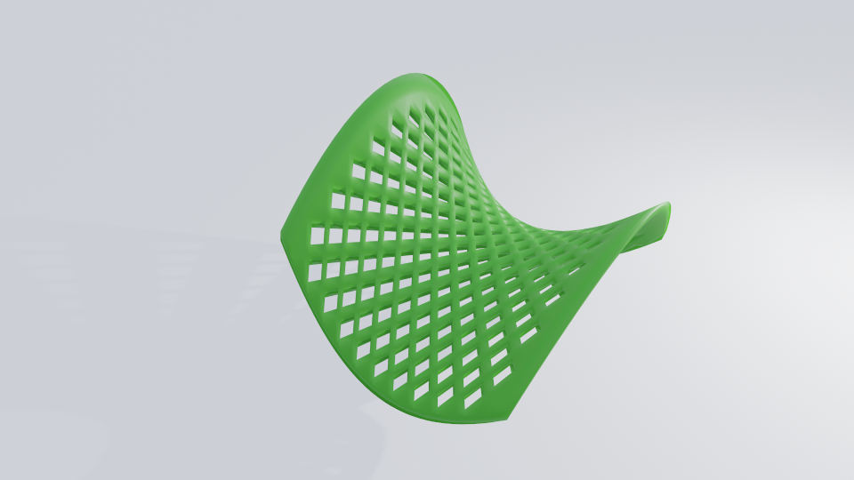
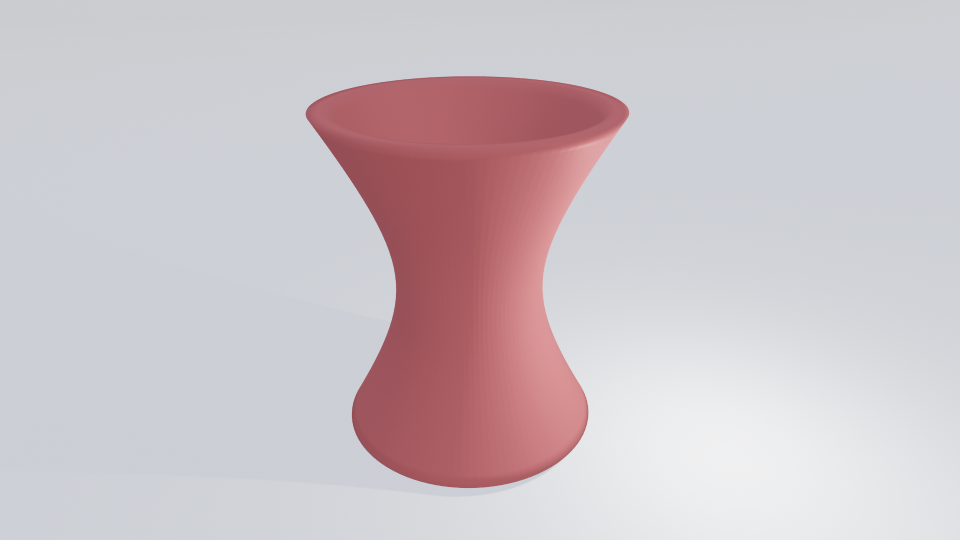

Experiments with generating models for 3D printing using Python and `numpy-stl`.

# basic idea

All models use "X-shape" as a base building block. X-shape is nice as it prints easily without supports

It can be stacked to form a grid

Being stacked at an angle, it might form cylindrical and spiral shapes

Each cell might have its own "fullness". Here fullness increases from the bottom to the top

Mathematical functions can be applied to the mesh points to stretch / scale / rotate parts of model.
For example, here is a flat grid transformed into hyperbolic paraboloid.

# how to use

1. install python >=3.9
2. install dependencies from requirements.txt
3. `PYTHONPATH=. python configs/<config>.py`

See the list of configs in the config folder

You can change any parameters in the config to adjust model.

# models showcase

Mosquito net that prints as a continuous roll up to several meters long. [[printables](https://www.printables.com/model/820145-mosquito-net-roll-for-the-patient)]

Vase 1. This is a circular x-shapes pattern. Transform is added to move all 
points away from the main axis as height increases, so the vase expands towards the top.  [[printables](https://www.printables.com/model/820157-geometric-vase)]

Vase 2. This is Vase 0 with an added transform that rotates all points as height increases. [[printables](https://www.printables.com/model/820183-tornado-vase)]

Vase 3. This is Vase 1, but cells have 100% fullness.

Vase 4. This is vase 2, but with higher density of x-shapes and added transform to stretch 
the rim in a wave-like pattern.

Vase 5. Surface points moved away from the axis by the sin of height + angle. [[printables](https://www.printables.com/model/820184-cone-shaped-vase)]

Glass with groove. Groove is formed by several x-shape layers with 100% fullness. [[printables](https://www.printables.com/model/820187-geometric-glass-with-a-groove)]

Lampshade. It's a circular x-shapes pattern warped into a round shape. Fullness increases towards
the top so more light is reflected down. [[printables](https://www.printables.com/model/820152-lampshade)]

Plate for fruits. Fullness increases towards the bottom.

Hyperboloid of revolution.

