Experiments with generating models for 3D printing using Python with `numpy-stl`.

# basic idea

All models use "X-shape" as a base building block

X-shapes can be stacked to form a grid
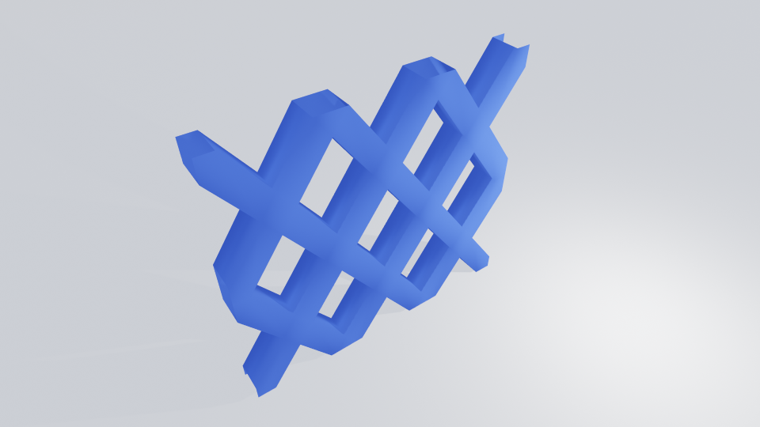

If stacked at an angle, they might form cylindrical or spiral shapes
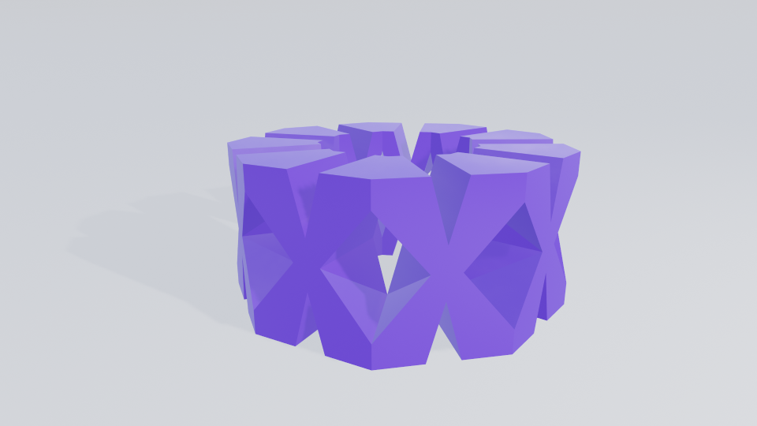
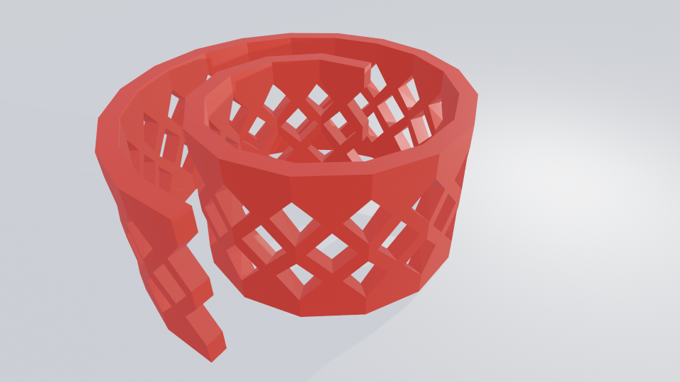

Each cell might have its own "fullness". Here fullness increases from the bottom to the top
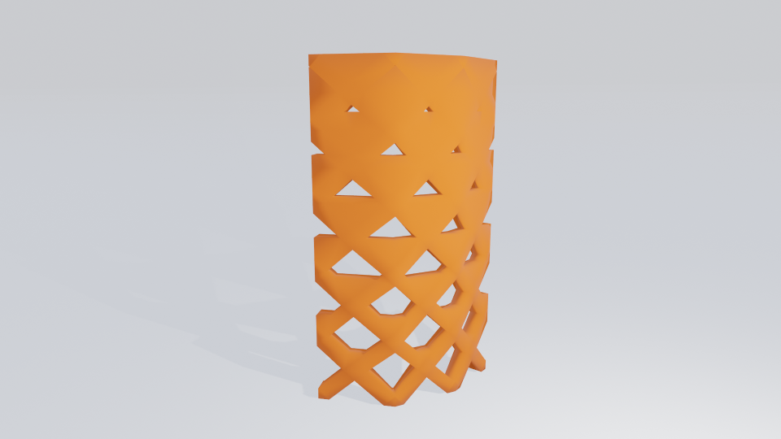

# how to use

1. install python >=3.9
2. install dependencies from requirements.txt
3. `PYTHONPATH=. python configs/<config>.py`

See the list of configs in the config folder

You can change any parameters in the config to adjust model.

# models showcase

Mosquito net roll
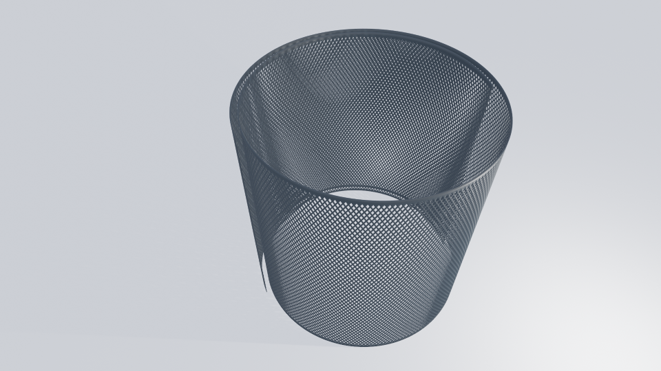

Glass with groove
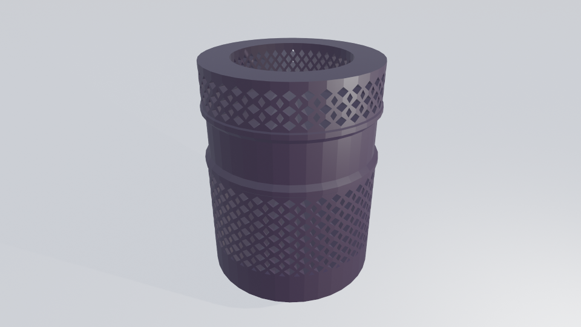

Glass
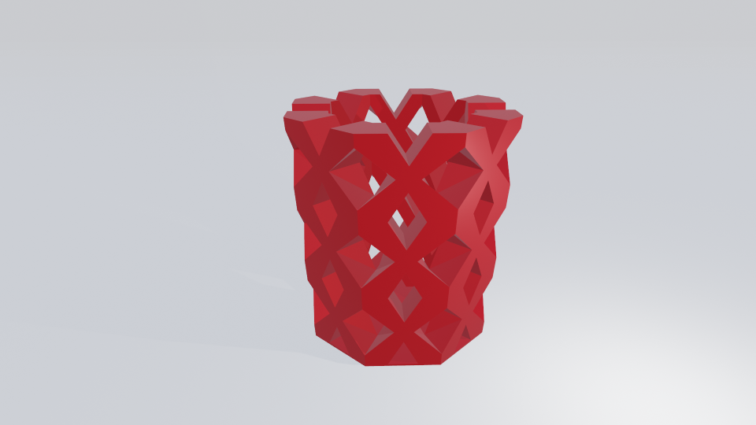

Vases

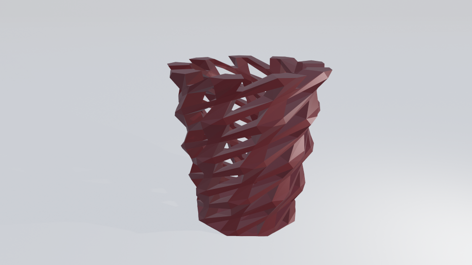
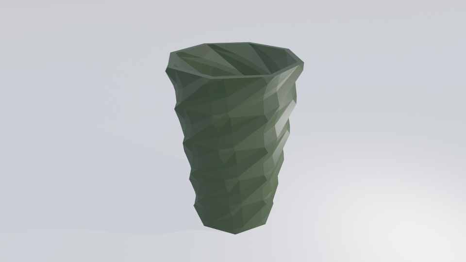
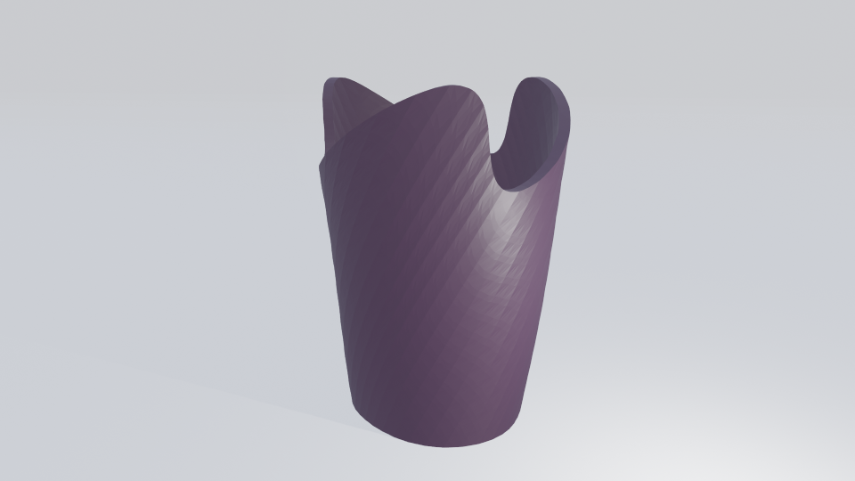
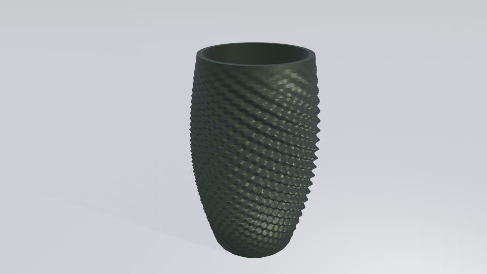

Lampshade
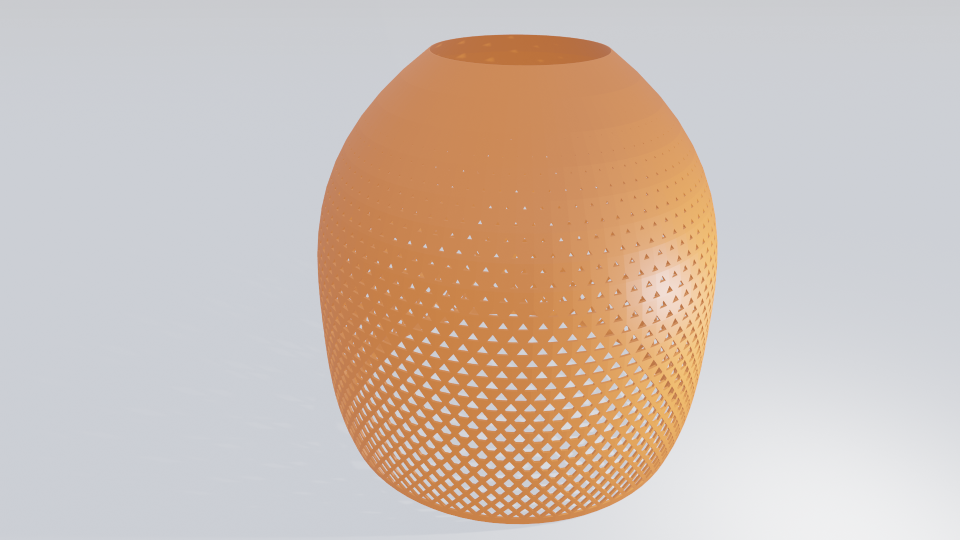

Plate
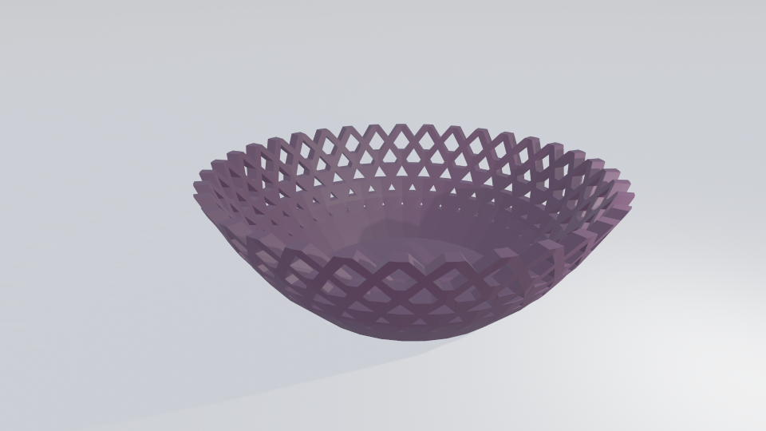
